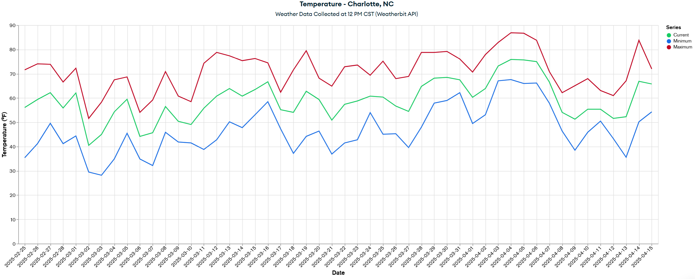
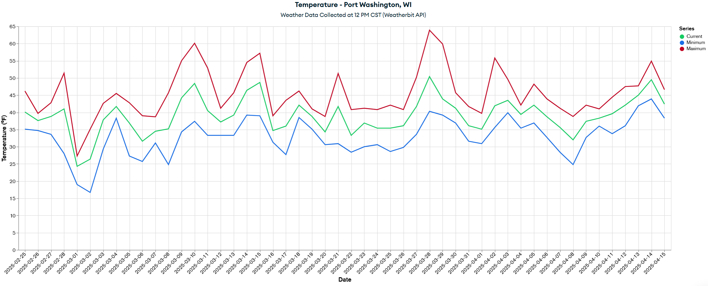

# Weather Comparison Tracker

I created this repository as a personal project that compares daily weather between **Port Washington, WI** (where I moved from) and **Charlotte, NC** (where I moved to). As a way to get excited about my move, I built this to track how the climates differ over time and to visualize the warmer weather, higher humidity, less snow, and overall better weather down in Charlotte versus my hometown of Port Washington.

---

## Project Overview

This project collects weather data using Weatherbit.io's API endpoints, sending that data to a cluster on MongoDB, and using MongoDB's charts to create visualizations that compare the weather between these two cities. It also sends fun Discord notifications when unusual or interesting weather events occur.

## Temperature Comparison Snapshots

### Charlotte Temperature Trends

### Port Washington Temperature Trends

## Live Dashboard

The interactive MongoDB Charts dashboard for this project can be viewed here:

**[View Live Weather Comparison Dashboard](https://charts.mongodb.com/charts-project-0-qnvswyz/dashboards/67d9bddd-64c1-46fd-887f-d9a30033d15d)**

### What It Does

- Pulls daily weather data from a public weather API  
- Stores historical records in **MongoDB**  
- Generates visualizations comparing both cities  
- Sends Discord alerts for events like:
  - Snow in Charlotte  
  - Charlotte having a colder current temperature than in Port Washington  
  - Port Washington having a warmer current temperature than in Charlotte  

---

## Technologies Used

- Python  
- Weatherbit.io's API  [https://www.weatherbit.io/](https://www.weatherbit.io/api/weather-current)
- MongoDB  
- A simple dashboard using charts on MongoDB  
- Discord webhooks  
- Scheduled automation via GitHub Actions 

---

## What I Learned

This project helped me practice:

- Working with external APIs  
- Building a simple automated data pipeline  
- Storing and querying data in MongoDB  
- Creating basic visualizations  
- Integrating software with Discord notifications  

---

This is a small and simple project, but it was a fun way to combine programming and data collection into my real-life move to a new city! Instead of interpreting the better weather down in Charlotte, my wife and I now experience how much better this is for us in comparison to Port Washington.
